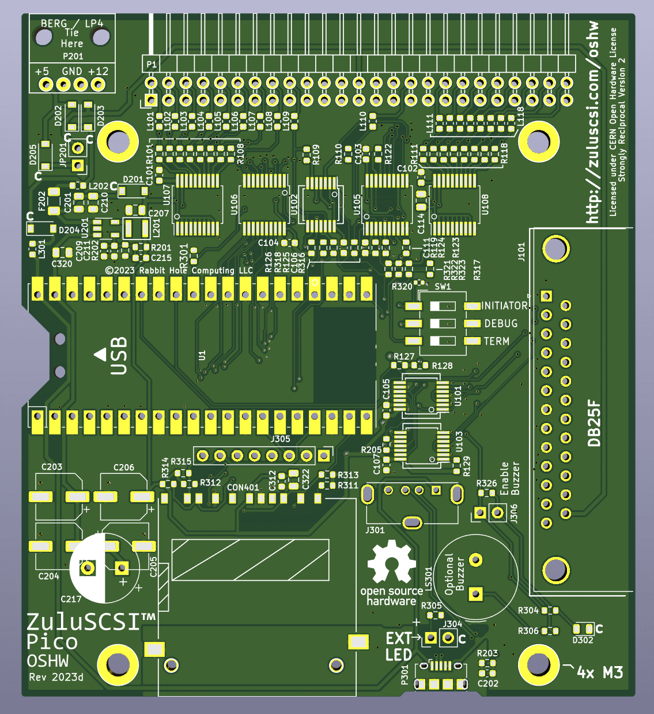

ZuluSCSI™ Pico Community Edition - Open Source Hardware
========================

This repository contains the KiCAD 7 schematic and PCB design files for the Pico-based ZuluSCSI™ SCSI to SD storage emulator, which is derived from the ZuluSCSI RP2040 board design. Firmware for ZuluSCSI is available at http://github.com/ZuluSCSI/ZuluSCSI-firmware.

This hardware design is licensed under the terms of the strongly reciprocal CERN OHL-S V2 license, which can be viewed in full at https://ohwr.org/cern_ohl_s_v2.txt and https://ohwr.org/cern_ohl_s_v2.pdf. 

ZuluSCSI™ is a registered trademark of Rabbit Hole Computing, and may not be used commercially without the express written consent of Rabbit Hole Computing. Individuals producing ZuluSCSI boards for personal use are hereby granted permission to use the ZuluSCSI trademark in a noncommercial capacity.

_Any_ use of the ZuluSCSI trademark in a **commercial** context requires prior written consent from Rabbit Hole Computing.

Firmware for ZuluSCSI is licensed under the GNU GPL Version 3, and can be found at https://github.com/zuluscsi/ZuluSCSI-firmware

Generating fabrication files
----------------------------

The component part numbers are stored in KiCAD schematic.
Manufacturing files, including assembly BOM, can be generated using [KiKit](https://github.com/yaqwsx/KiKit).
